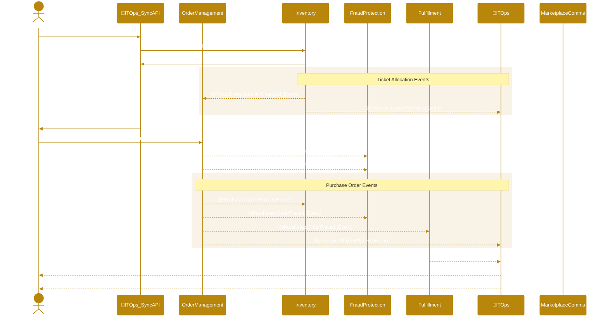

```mermaid
%%{init: {
  'theme': 'base',
  'themeVariables': {
    'primaryColor': '#B8860B',
    'primaryTextColor': '#FFFFFF',
    'primaryBorderColor': '#B8860B',
    'lineColor': '#B8860B',
    'signalColor': '#B8860B',
    'signalTextColor': '#FFFFFF',
    'actorBkg': '#B8860B',
    'actorTextColor': '#FFFFFF',
    'actorLineColor': '#B8860B',
    'actorBorder': '#B8860B',
    'activationBkgColor': '#B8860B',
    'activationBorderColor': '#B8860B',
    'sequenceNumberColor': '#FFFFFF',
    'labelTextColor': '#FFFFFF'
  }
}}%%
sequenceDiagram
    actor Marketplace

    participant 🚚ITOps_SyncAPI
    participant OrderManagement
    participant Inventory
    participant FraudProtection
    participant Fulfillment
    participant 🚚ITOps
    participant MarketplaceComms

    Marketplace->>🚚ITOps_SyncAPI: 🔵PurchaseTickets (Command)
    🚚ITOps_SyncAPI->>Inventory: 🔵TicketAllocationRequest (Command)
    Inventory->>🚚ITOps_SyncAPI: 🟢TicketAllocationResponse (Response)
    
    rect rgb(184, 134, 11, 0.1)
        Note over Inventory,🚚ITOps: Ticket Allocation Events
        Inventory-->>OrderManagement: 🟡TicketGroupQuantityChanged (Event)
        Inventory-->>🚚ITOps: 🟡TicketsAllocatedToOrder (Event)
    end

    🚚ITOps_SyncAPI->>Marketplace: 🟢PurchaseAllocatedTickets (Response)
    
    Marketplace->>OrderManagement: 🔵ValidateOrder (Command)
    OrderManagement-->>FraudProtection: 🟡TicketGroupPriceAndQuantityChanged (Event)
    OrderManagement-->>FraudProtection: 🟡NeedAdditionalDataToCompletePurchase (Event)
    
    rect rgb(184, 134, 11, 0.1)
        Note over OrderManagement,🚚ITOps: Purchase Order Events
        OrderManagement-->>Inventory: 🟡PurchasedOrderPlaced (Event)
        OrderManagement-->>FraudProtection: 🟡PurchasedOrderPlaced (Event)
        OrderManagement-->>Fulfillment: 🟡PurchasedOrderPlaced (Event)
        OrderManagement-->>🚚ITOps: 🟡PurchasedOrderPlaced (Event)
    end
    
    Fulfillment-->>🚚ITOps: 🟡OrderFulfilled (Event)
    🚚ITOps-->>Marketplace: 🟡OrderPurchased (Event)
    🚚ITOps-->>Marketplace: 🟡OrderFulfilled (Event)
```
