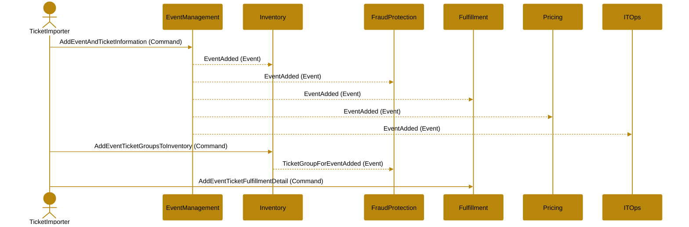

```mermaid
%%{init: {
  'theme': 'base',
  'themeVariables': {
    'primaryColor': '#B8860B',
    'primaryTextColor': '#000000',
    'primaryBorderColor': '#B8860B',
    'lineColor': '#B8860B',
    'signalColor': '#B8860B',
    'signalTextColor': '#000000',
    'actorBkg': '#B8860B',
    'actorTextColor': '#000000',
    'actorLineColor': '#B8860B',
    'actorBorder': '#B8860B',
    'activationBkgColor': '#B8860B',
    'activationBorderColor': '#B8860B',
    'sequenceNumberColor': '#000000'
  }
}}%%
sequenceDiagram
    actor TicketImporter

    participant EventManagement
    participant Inventory
    participant FraudProtection
    participant Fulfillment
    participant Pricing
    participant ITOps

    TicketImporter->>EventManagement: AddEventAndTicketInformation (Command)
    EventManagement-->>Inventory: EventAdded (Event)
    EventManagement-->>FraudProtection: EventAdded (Event)
    EventManagement-->>Fulfillment: EventAdded (Event)
    EventManagement-->>Pricing: EventAdded (Event)
    EventManagement-->>ITOps: EventAdded (Event)

    TicketImporter->>Inventory: AddEventTicketGroupsToInventory (Command)
    Inventory-->>FraudProtection: TicketGroupForEventAdded (Event)

    TicketImporter->>Fulfillment: AddEventTicketFulfillmentDetail (Command)
```
