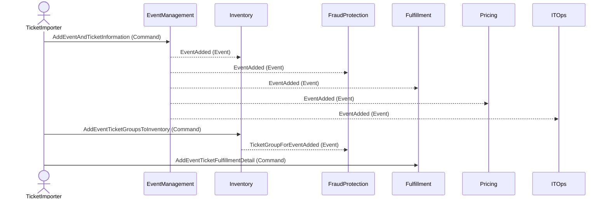

<link rel="stylesheet" href="mermaid-styles.css">

```mermaid
sequenceDiagram
    actor TicketImporter

    participant EventManagement
    participant Inventory
    participant FraudProtection
    participant Fulfillment
    participant Pricing
    participant ITOps

    TicketImporter->>EventManagement: AddEventAndTicketInformation (Command)
    EventManagement-->>Inventory: EventAdded (Event)
    EventManagement-->>FraudProtection: EventAdded (Event)
    EventManagement-->>Fulfillment: EventAdded (Event)
    EventManagement-->>Pricing: EventAdded (Event)
    EventManagement-->>ITOps: EventAdded (Event)

    TicketImporter->>Inventory: AddEventTicketGroupsToInventory (Command)
    Inventory-->>FraudProtection: TicketGroupForEventAdded (Event)

    TicketImporter->>Fulfillment: AddEventTicketFulfillmentDetail (Command)
```
