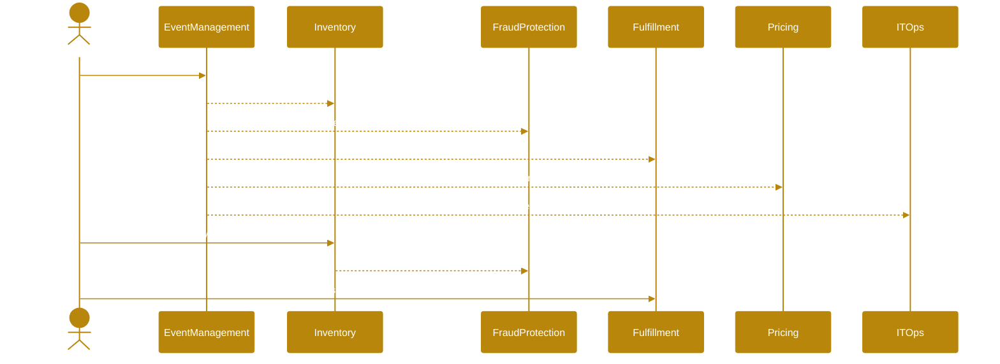

```mermaid
%%{init: {
  'theme': 'base',
  'themeVariables': {
    'primaryColor': '#B8860B',
    'primaryTextColor': '#FFFFFF',
    'primaryBorderColor': '#B8860B',
    'lineColor': '#B8860B',
    'signalColor': '#B8860B',
    'signalTextColor': '#FFFFFF',
    'actorBkg': '#B8860B',
    'actorTextColor': '#FFFFFF',
    'actorLineColor': '#B8860B',
    'actorBorder': '#B8860B',
    'activationBkgColor': '#B8860B',
    'activationBorderColor': '#B8860B',
    'sequenceNumberColor': '#FFFFFF',
    'labelTextColor': '#FFFFFF'
  }
}}%%
sequenceDiagram
    actor TicketImporter

    participant EventManagement
    participant Inventory
    participant FraudProtection
    participant Fulfillment
    participant Pricing
    participant ITOps

    TicketImporter->>EventManagement: <span style="color:#4A90E2">AddEventAndTicketInformation (Command)</span>
    EventManagement-->>Inventory: EventAdded (Event)
    EventManagement-->>FraudProtection: EventAdded (Event)
    EventManagement-->>Fulfillment: EventAdded (Event)
    EventManagement-->>Pricing: EventAdded (Event)
    EventManagement-->>ITOps: EventAdded (Event)

    TicketImporter->>Inventory: <span style="color:#4A90E2">AddEventTicketGroupsToInventory (Command)</span>
    Inventory-->>FraudProtection: TicketGroupForEventAdded (Event)

    TicketImporter->>Fulfillment: <span style="color:#4A90E2">AddEventTicketFulfillmentDetail (Command)</span>
```
