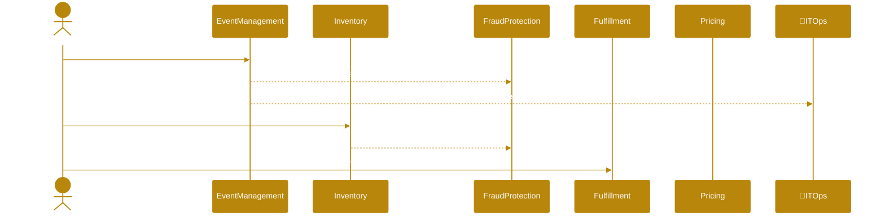

```mermaid
%%{init: {
  'theme': 'base',
  'themeVariables': {
    'primaryColor': '#B8860B',
    'primaryTextColor': '#FFFFFF',
    'primaryBorderColor': '#B8860B',
    'lineColor': '#B8860B',
    'signalColor': '#B8860B',
    'signalTextColor': '#FFFFFF',
    'actorBkg': '#B8860B',
    'actorTextColor': '#FFFFFF',
    'actorLineColor': '#B8860B',
    'actorBorder': '#B8860B',
    'activationBkgColor': '#B8860B',
    'activationBorderColor': '#B8860B',
    'sequenceNumberColor': '#FFFFFF',
    'labelTextColor': '#FFFFFF'
  }
}}%%
sequenceDiagram
    actor TicketImporter

    participant EventManagement
    participant Inventory
    participant FraudProtection
    participant Fulfillment
    participant Pricing
    participant 🚚ITOps    
    
    TicketImporter->>EventManagement: 🔵AddEventAndTicketInformation (Command)
    EventManagement-->>FraudProtection: 🟡EventAdded (Event)
    EventManagement-->>🚚ITOps: 🟡EventAdded (Event)
    TicketImporter->>Inventory: 🔵AddEventTicketGroupsToInventory (Command)
    Inventory-->>FraudProtection: 🟡TicketGroupForEventAdded (Event)

    TicketImporter->>Fulfillment: 🔵 AddEventTicketFulfillmentDetail (Command)
```
